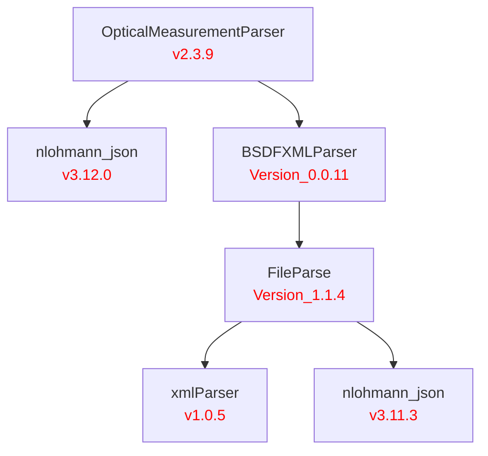

```mermaid
graph TD
    %% Package definitions
    xmlParser[xmlParser<br/><font color='red'>v1.0.5</font>]
    nlohmann_json_fileparse[nlohmann_json<br/><font color='red'>v3.11.3</font>]
    nlohmann_json[nlohmann_json<br/><font color='red'>v3.12.0</font>]
    FileParse[FileParse<br/><font color='red'>Version_1.1.4</font>]
    BSDFXMLParser[BSDFXMLParser<br/><font color='red'>Version_0.0.11</font>]
    OpticalMeasurementParser[OpticalMeasurementParser<br/><font color='red'>v2.3.9</font>]

    %% Package relations
    OpticalMeasurementParser --> nlohmann_json
    OpticalMeasurementParser --> BSDFXMLParser
    BSDFXMLParser --> FileParse
    FileParse --> xmlParser
    FileParse --> nlohmann_json_fileparse
```
